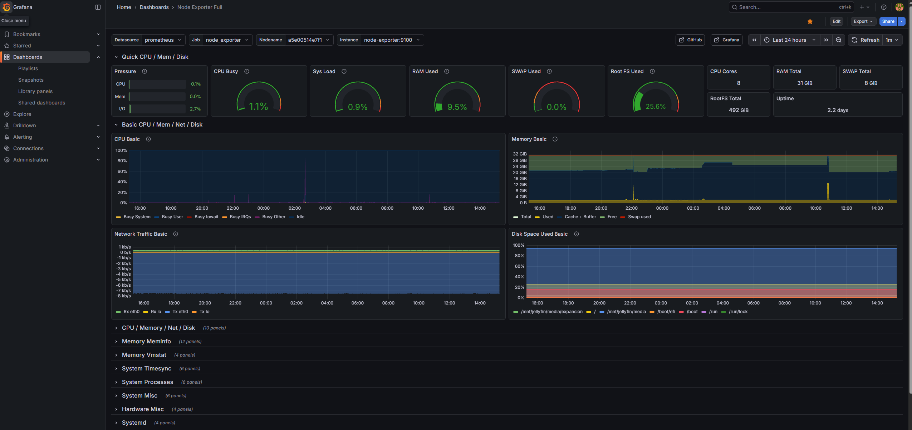
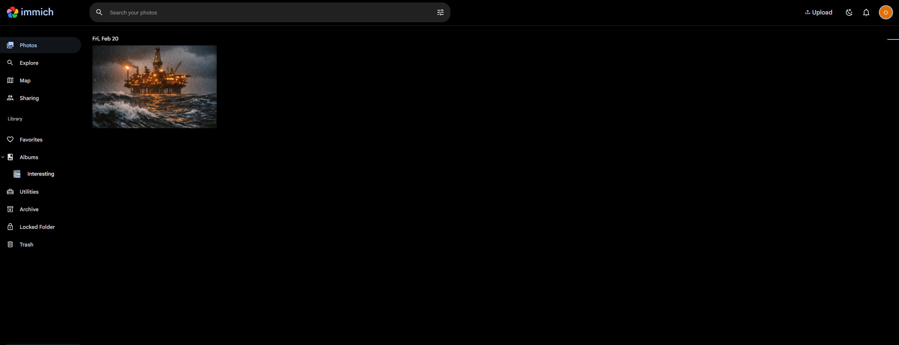
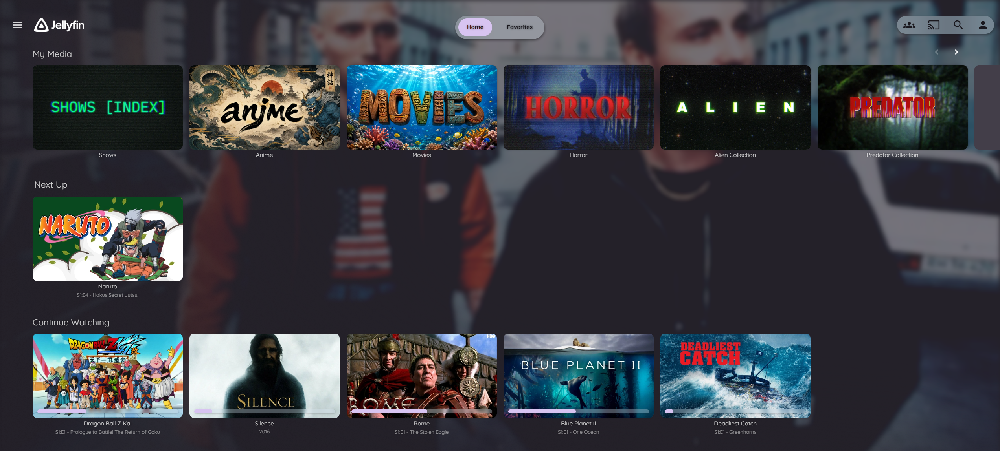

# Owen Wallace - Infrastructure & Operations Portfolio

This repository documents a self-hosted Linux infrastructure environment used for media services, personal cloud apps, monitoring, reverse proxy routing, and AI-assisted application deployment.

This is a daily-use server environment with public HTTPS endpoints, Dockerized services, observability, private networking, file sharing, and AI-assisted custom applications running together on infrastructure I administer end to end.

## What This Demonstrates

- Linux server administration on Ubuntu
- Docker-based service deployment and operations
- Reverse proxy routing with Caddy and automatic HTTPS
- Monitoring with Grafana, Prometheus, and node-exporter
- Private access with Tailscale and SSH
- SMB/Samba media shares for local-network access
- Self-hosted services for media, photos, books, and AI model serving
- AI-assisted custom applications deployed and operated alongside packaged services
- Practical troubleshooting after outages, config errors, and service failures

## Active Service Stack

| Area | Services |
| --- | --- |
| Reverse proxy | Caddy |
| Media | Jellyfin |
| Books | Kavita |
| Photos | Immich, Postgres, Valkey/Redis, machine learning service |
| Monitoring | Grafana, Prometheus, node-exporter |
| AI infrastructure | Ollama |
| File sharing | Samba |
| Remote access | Tailscale, SSH |
| Custom apps | TradeFlow backend, self-hosted wiki archive |
| Downloads | qBittorrent-nox |

## Repository Contents

- `config/caddy/Caddyfile` - public-facing reverse proxy configuration
- `docs/server-inventory.md` - active containers, services, routes, and ports
- `docs/architecture.md` - high-level explanation of the stack
- `docs/resume-supporting-projects.md` - resume-ready project language and proof points
- `scripts/health-check.sh` - server health check command script
- `resume/` - final resume PDF for applications and portfolio use

## Selected Screenshots

<table>
  <tr>
    <td width="50%">
      
      
<strong>Grafana</strong> Live infrastructure monitoring showing CPU, memory, disk, swap, and network activity for the production server.

    </td>
    <td width="50%">
      
      
<strong>Immich</strong> Self-hosted photo management and backup running as part of the broader personal cloud stack.

    </td>
  </tr>
  <tr>
    <td colspan="2">
      
      
<strong>Jellyfin</strong> A daily-use media service deployed and operated inside the same self-hosted environment.

    </td>
  </tr>
</table>

## Notes

Sensitive credentials, private keys, tokens, passwords, and application data are excluded. Public domains, localhost bindings, and service names have remained included.
